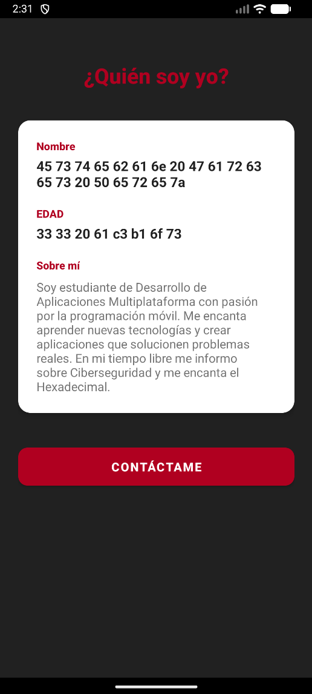

# AppAndroidLayouts - MiPresentaciónApp (Fsociety Edition)

Proyecto desarrollado para la **Actividad Evaluable 1** del módulo **PMDM** (Programación Multimedia y Dispositivos Móviles) de **2º DAM**.

---

## 📱 Descripción del Proyecto

Aplicación Android nativa desarrollada en **Kotlin** con **layouts XML** inspirada en la estética de Mr. Robot y Fsociety. La aplicación permite:
- Visualizar información personal con datos codificados en hexadecimal
- Navegar entre diferentes pantallas (Activities)
- Introducir datos mediante formularios con validaciones completas
- Mostrar confirmaciones de envío

### Temática Personalizada
La aplicación presenta una temática dark/hacker con:
- Logo de Fsociety como icono principal
- Colores oscuros (#212121) con acentos en rojo (#B00020)
- Información personal codificada en hexadecimal
- Estética inspirada en ciberseguridad

---

## 🚀 Pasos para Abrir y Ejecutar el Proyecto

### Requisitos Previos

- **Android Studio**: Hedgehog (2023.1.1) o superior
- **JDK**: 8 o superior
- **SDK de Android**: 
  - Minimum SDK: API 24 (Android 7.0)
  - Target SDK: API 34 (Android 14)

### Instrucciones de Instalación

1. **Clonar o Descargar el Proyecto**
   - Si usas Git
   ```bash
    git clone https://github.com/Speeson/ProgramacionMoviles/edit/master/Act01Eva01/AppAndroidLayouts
   ```
   - Sino, descarga el archivo ZIP, Descomprímelo en una carpeta de tu elección

2. **Abrir en Android Studio**
   - Inicia Android Studio
   - Selecciona `File → Open`
   - Navega hasta la carpeta del proyecto
   - Selecciona la carpeta raíz (donde está el archivo `build.gradle.kts`)
   - Haz clic en `OK`

3. **Sincronizar dependencias**
   - Android Studio sincronizará automáticamente las dependencias de Gradle
   - Si no lo hace, haz clic en `File → Sync Project with Gradle Files`
   - Espera a que termine la sincronización (puede tardar unos minutos)

4. **Ejecutar la aplicación**

   **Opción A: Usando un emulador**
   - Ve a `Tools → Device Manager`
   - Si no tienes un emulador, crea uno:
     - Clic en `Create Device`
     - Selecciona un dispositivo (recomendado: Pixel 6)
     - Descarga una imagen del sistema (recomendado: API 34)
     - Finaliza la configuración
   - Inicia el emulador
   - Haz clic en el botón `Run` ▶️ (verde) en la barra superior
   - O presiona `Shift + F10`

   **Opción B: Usando un dispositivo físico**
   - Habilita las opciones de desarrollador en tu dispositivo Android:
     - Ve a `Ajustes → Acerca del teléfono`
     - Toca 7 veces en `Número de compilación`
   - Activa la depuración USB:
     - Ve a `Ajustes → Opciones de desarrollador`
     - Activa `Depuración USB`
   - Conecta tu dispositivo al ordenador con un cable USB
   - Autoriza la conexión en el dispositivo
   - En Android Studio, selecciona tu dispositivo en la barra superior
   - Haz clic en `Run` ▶️

5. **Verificar la instalación**
   - La aplicación se instalará y abrirá automáticamente
   - Verás la pantalla principal con el logo de Fsociety y el mensaje "Bienvenido a Fsociety"

---

## 📸 Capturas de Pantalla

### Pantalla 1: MainActivity (Pantalla Principal)


**Descripción:**
- Logo de Fsociety (icono personalizado)
- Título: "Bienvenido a Fsociety"
- Subtítulo: "Conoce más sobre mí y contacta conmigo"
- Botón rojo: "Accede a mis datos"
- Fondo oscuro (#212121) estilo hacker

---

### Pantalla 2: PresentacionActivity (Presentación Personal)



**Descripción:**
- Título: "¿Quién soy yo?"
- Card blanca con información personal:
  - **Nombre** (en hexadecimal): `45 73 74 65 62 61 6e 20 47 61 72 63 65 73 20 50 65 72 65 7a`
    - Decodificado: Esteban Garces Perez
  - **Edad** (en hexadecimal): `33 33 20 61 c3 b1 6f 73`
    - Decodificado: 33 años
  - **Descripción**: Información personal sobre intereses en desarrollo móvil, ciberseguridad y hexadecimal
- Botón "Contáctame" para acceder al formulario
- Fondo oscuro consistente con la temática

---

### Pantalla 3: FormularioActivity (Formulario de Contacto)


**Descripción:**
- Título: "Formulario de Contacto"
- Subtítulo informativo
- Card con campos de entrada:
  - Nombre (EditText)
  - Correo electrónico (EditText)
  - Mensaje (EditText multilinea - 120dp de altura)
- Botón rojo "Enviar mensaje"
- Área de confirmación oculta por defecto
- Fondo oscuro con campos de entrada en gris claro

---

### Pantalla 4: Confirmación de Envío


**Descripción:**
- Toast: "Formulario enviado correctamente"
- TextView verde mostrando:
  - ✓ Datos recibidos correctamente
  - Nombre ingresado
  - Correo ingresado
  - Mensaje ingresado
- Formulario limpio después del envío
- TextView de confirmación con fondo verde claro (#E8F5E9)

---

## ✅ Validaciones Implementadas

### 1. Validación de Campos Vacíos

**Descripción:**  
El formulario no permite enviar datos si algún campo está vacío.

**Implementación:**
```kotlin
if (nombre.isEmpty()) {
    etNombre.error = "El nombre es obligatorio"
    etNombre.requestFocus()
    return
}
```

**Comportamiento:**
- Se verifica cada campo con el método `.isEmpty()`
- Si un campo está vacío, se muestra un mensaje de error directamente en el campo
- El cursor se posiciona automáticamente en el campo con error usando `requestFocus()`
- El proceso de envío se detiene con `return` hasta corregir el error
- El campo con error queda marcado visualmente

**Campos validados:**
- Nombre (obligatorio)
- Correo electrónico (obligatorio)
- Mensaje (obligatorio)

**Mensajes de error:**
- "El nombre es obligatorio"
- "El correo es obligatorio"
- "El mensaje es obligatorio"

---

### 2. Validación de Formato de Correo Electrónico

**Descripción:**  
Verifica que el correo electrónico tenga un formato válido usando los patrones de validación de Android.

**Implementación:**
```kotlin
if (!Patterns.EMAIL_ADDRESS.matcher(correo).matches()) {
    etCorreo.error = "Formato de correo inválido"
    etCorreo.requestFocus()
    return
}
```

**Comportamiento:**
- Utiliza la clase `Patterns.EMAIL_ADDRESS` de Android para validar el formato
- Verifica que contenga el símbolo "@" y un dominio válido
- Se ejecuta después de verificar que el campo no esté vacío

**Ejemplos de formatos válidos:**
- usuario@gmail.com
- nombre.apellido@empresa.es
- contacto123@dominio.co.uk
- esteban_garces@hotmail.com

**Ejemplos de formatos inválidos:**
- usuario@gmail (sin dominio completo)
- @gmail.com (sin usuario)
- usuario.gmail.com (sin @)
- usuario@.com (dominio incompleto)

**Feedback al usuario:**
- Mensaje de error específico: "Formato de correo inválido"
- El campo queda marcado en rojo
- El cursor vuelve automáticamente al campo para facilitar la corrección

---

### 3. Flujo Completo de Validación

**Orden de ejecución de validaciones:**
1. ✅ **Validar nombre** → Verificar que no esté vacío
2. ✅ **Validar correo (vacío)** → Verificar que no esté vacío
3. ✅ **Validar formato de correo** → Verificar patrón válido con `Patterns.EMAIL_ADDRESS`
4. ✅ **Validar mensaje** → Verificar que no esté vacío
5. ✅ **Si todas las validaciones pasan** → Proceder con el envío

**Después de validaciones exitosas:**
- Se muestra un **Toast** con el mensaje: "Formulario enviado correctamente"
- Se hace visible el **TextView de confirmación** (que estaba oculto con `visibility="gone"`)
- El TextView muestra los datos ingresados en formato legible:
  ```
  ✓ Datos recibidos correctamente:
  
  Nombre: [nombre ingresado]
  Correo: [correo ingresado]
  Mensaje: [mensaje ingresado]
  ```
- Se limpian todos los campos del formulario llamando a `limpiarFormulario()`
- El usuario puede enviar un nuevo mensaje sin necesidad de salir de la pantalla

**Método de limpieza implementado:**
```kotlin
private fun limpiarFormulario() {
    etNombre.text.clear()
    etCorreo.text.clear()
    etMensaje.text.clear()
}
```

---

## 🎨 Características Técnicas

### Tecnologías Utilizadas

- **Lenguaje:** Kotlin
- **IDE:** Android Studio
- **Layouts:** XML con ConstraintLayout
- **Componentes UI:**
  - TextView, EditText, Button, ImageView
  - CardView para tarjetas de información
  - ScrollView para contenido desplazable
  - LinearLayout dentro de ScrollView y CardView
- **Navegación:** Intents explícitos
- **Validación:** Patterns.EMAIL_ADDRESS de Android
- **Tema:** Material Components (NoActionBar)

### Arquitectura del Proyecto

```
app/src/main/
├── java/com/example/appandroidlayouts/
│   ├── MainActivity.kt
│   ├── PresentacionActivity.kt
│   └── FormularioActivity.kt
├── res/
│   ├── layout/
│   │   ├── activity_main.xml
│   │   ├── activity_presentacion.xml
│   │   └── activity_formulario.xml
│   ├── values/
│   │   ├── strings.xml
│   │   ├── colors.xml
│   │   ├── styles.xml
│   │   └── themes.xml
│   ├── drawable/
│   │   ├── fsociety.png (icono personalizado)
│   │   ├── ic_launcher_background.xml
│   │   └── ic_launcher_foreground.xml
│   └── mipmap/
└── AndroidManifest.xml
```

### Diseño y Estilos Personalizados

**Paleta de colores temática (colors.xml):**
- **Primary**: #B00020 (rojo oscuro - estilo Fsociety)
- **Primary Dark**: #3700B3 (morado oscuro)
- **Accent**: #03DAC6 (verde agua/cian)
- **Background**: #F5F5F5 (gris muy claro)
- **Text Primary**: #212121 (negro casi total - fondo oscuro de la app)
- **Card Background**: #FFFFFF (blanco para tarjetas)
- **Input Background**: #F0F0F0 (gris claro para campos de entrada)
- **Success Background**: #E8F5E9 (verde muy claro para confirmaciones)

**Estilos definidos en styles.xml:**
- **TituloGrande**: 28sp, bold, color primary (#B00020)
- **TextoNormal**: 16sp, color text_secondary
- **TextoNormal2**: 16sp, color card_background (para texto sobre fondo oscuro)
- **TextoEtiqueta**: 14sp, bold, color primary
- **TextoValor**: 18sp, bold, color text_primary
- **TextoConfirmacion**: 14sp, monospace, color text_success
- **BotonPrimario**: 16sp, bold, fondo rojo, esquinas redondeadas (12dp)

### Características de Diseño

**ConstraintLayout:**
- Todos los layouts principales utilizan ConstraintLayout como contenedor raíz
- Permite posicionamiento flexible y responsive
- Constraints utilizados: Top, Bottom, Start, End

**Elementos visuales:**
- Logo Fsociety como imagen principal
- Fondos oscuros (#212121) en todas las pantallas
- Cards con fondo blanco para destacar información
- Botones con esquinas redondeadas (cornerRadius: 12dp)
- Elevación en cards (4dp) para efecto de profundidad

**Splash Screen personalizado:**
- Fondo negro (#212121) al iniciar la aplicación
- Logo de Fsociety visible durante la carga
- Barra de estado y navegación en negro
- Configurado en `themes.xml` con `android:windowBackground`

---

## 🔄 Navegación

### Flujo de navegación:

```
MainActivity (Fsociety Welcome)
    ↓ (clic en "Accede a mis datos")
PresentacionActivity (¿Quién soy yo? - Info en hexadecimal)
    ↓ (clic en "Contáctame")
FormularioActivity (Formulario de contacto con validaciones)
    ↓ (clic en "Enviar mensaje")
Confirmación (mismo Activity, TextView visible)
```

### Implementación:
- Uso de `Intent` explícitos para navegación entre Activities
- MainActivity → PresentacionActivity
- PresentacionActivity → FormularioActivity
- Botón "Atrás" del sistema funcionando correctamente
- No se implementó paso de datos entre Activities (dato básico cumplido)

---

## 🎯 Extras Implementados para Nota Alta

### ✅ 1. ConstraintLayout en todos los layouts
- activity_main.xml: ConstraintLayout raíz
- activity_presentacion.xml: ConstraintLayout raíz
- activity_formulario.xml: ConstraintLayout raíz con ScrollView interno

### ✅ 2. styles.xml personalizado
- Archivo completo con 7 estilos personalizados
- Estilos para títulos, textos, etiquetas y botones
- Consistencia visual en toda la aplicación

### ✅ 3. colors.xml personalizado
- Paleta completa de 11 colores
- Temática oscura/roja inspirada en Fsociety
- Colores específicos para cada elemento (primary, accent, backgrounds, texts)

### ✅ 4. Icono de app personalizado
- Logo de Fsociety implementado
- Archivo: drawable/fsociety.png
- Fondo blanco en ic_launcher_background.xml
- Icono visible en launcher y activity principal

### ✅ 5. README.md completo
- Pasos detallados para ejecutar el proyecto
- Secciones para capturas de pantalla
- Explicación exhaustiva de validaciones
- Documentación técnica completa

### ✅ 6. Temática personalizada
- Codificación hexadecimal de datos personales
- Estética dark/hacker
- Referencias a ciberseguridad
- Integración visual consistente
- Splash screen con fondo negro personalizado

---

## 📦 Dependencias

Las siguientes dependencias están incluidas en `build.gradle.kts`:

```kotlin
dependencies {
    implementation("androidx.core:core-ktx:1.12.0")
    implementation("androidx.appcompat:appcompat:1.6.1")
    implementation("com.google.android.material:material:1.11.0")
    implementation("androidx.constraintlayout:constraintlayout:2.1.4")
    implementation("androidx.cardview:cardview:1.0.0")
}
```

---

## 🔐 Información Personal (Codificada)

Los datos personales están codificados en hexadecimal UTF-8:

**Nombre:**
- Hexadecimal: `45 73 74 65 62 61 6e 20 47 61 72 63 65 73 20 50 65 72 65 7a`
- Decodificado: Esteban Garces Perez

**Edad:**
- Hexadecimal: `33 33 20 61 c3 b1 6f 73`
- Decodificado: 33 años

Esta codificación forma parte de la temática de ciberseguridad de la aplicación.

---

## 👨‍💻 Autor

**Nombre:** Esteban Garces Perez  
**Edad:** 33 años  
**Curso:** 2º DAM  
**Módulo:** PMDM - Programación Multimedia y Dispositivos Móviles  
**Centro:** La Otra FP
**Fecha:** Octubre 2025

**Intereses:**
- Desarrollo de Aplicaciones Multiplataforma
- Programación móvil con Kotlin
- Ciberseguridad
- Codificación hexadecimal

---

## 📝 Notas Adicionales

- La aplicación no requiere permisos especiales
- Compatible con Android 7.0 (API 24) y superior
- Diseño responsive adaptado a diferentes tamaños de pantalla
- Icono personalizado de Fsociety implementado
- Splash screen con fondo negro personalizado (#212121)
- Todas las Activities declaradas correctamente en AndroidManifest.xml
- Tema oscuro sin ActionBar (NoActionBar)
- Validaciones completas en formularios
- Feedback visual claro para el usuario
- Barra de estado y navegación en color negro para experiencia inmersiva

---

## 🐛 Solución de Problemas

### La aplicación no se instala
- Verifica que el emulador/dispositivo esté conectado
- Ejecuta `Build → Clean Project`
- Luego ejecuta la app con el botón Run

### Errores de compilación
- Asegúrate de que Gradle esté sincronizado: `File → Sync Project with Gradle Files`
- Verifica que todas las dependencias estén instaladas

### El icono no se ve correctamente
- El icono está en `drawable/fsociety.png`
- Verifica que el nombre sea todo en minúsculas
- El fondo es blanco definido en `ic_launcher_background.xml`

### El splash screen tiene fondo blanco
- Verifica que `themes.xml` tenga configurado:
  ```xml
  <item name="android:windowBackground">@color/text_primary</item>
  ```
- El color `text_primary` debe ser `#212121` en `colors.xml`
- Cierra completamente la app y vuelve a ejecutarla

### Los textos en hexadecimal no se ven
- Están definidos en `strings.xml`:
  - `nombre_ejemplo`: nombre en hexadecimal
  - `edad_ejemplo`: edad en hexadecimal
- Son valores de string normales, no requieren decodificación en código

### El TextView de confirmación no aparece
- Por defecto está oculto: `android:visibility="gone"`
- Se hace visible solo después de enviar el formulario con éxito
- Revisa que FormularioActivity.kt tenga: `tvConfirmacion.visibility = View.VISIBLE`

---

## 📄 Licencia

Este proyecto es de uso educativo para el módulo PMDM de 2º DAM.

---

**Versión:** 1.0 - Fsociety Edition  
**Última actualización:** Octubre 2025  
**Tema:** Mr. Robot / Fsociety / Ciberseguridad
