# 📱 Gestor de Clientes - Aplicación CRM

**Actividad Evaluable 2**  
**Asignatura:** Programación Multimedia y Dispositivos Móviles (PMDM)  
**Nivel Educativo:** 2º DAM  
**Curso:** 2024/2025

---

## 📋 Descripción del Proyecto

Aplicación móvil Android que permite registrar, buscar y gestionar clientes como si formases parte de un pequeño CRM de empresa. Desarrollada con **Kotlin** y **XML** en Android Studio, implementa persistencia local con **SQLite** y una interfaz profesional siguiendo los principios de **Material Design**.

El proyecto cumple con todos los requisitos funcionales solicitados, incluyendo validaciones completas, persistencia de datos, y funcionalidades extra como búsqueda en tiempo real, contador de clientes, botones de acción directa (llamar y enviar email), modo oscuro/claro, y modo zurdo/diestro para mejorar la accesibilidad.

---

## ⚙️ Requisitos Técnicos

- **Android Studio:** Hedgehog (2023.1.1) o superior
- **Lenguaje:** Kotlin 1.9+
- **SDK Mínimo:** API 24 (Android 7.0 Nougat)
- **SDK Objetivo:** API 34 (Android 14)
- **Gradle:** 8.0+

---

## 🚀 Instrucciones para Abrir y Ejecutar el Proyecto

### Paso 1: Clonar o Descargar el Proyecto
```bash
# Si usas Git
git clone https://github.com/Speeson/ProgramacionMoviles/tree/master/AplicacionCRM

# O descarga el archivo ZIP y descomprímelo
```

### Paso 2: Abrir en Android Studio
1. Abre **Android Studio**
2. Selecciona **File → Open**
3. Navega hasta la carpeta del proyecto **AplicacionCRM**
4. Haz clic en **OK**
5. Espera a que **Gradle** sincronice automáticamente (puede tardar unos minutos la primera vez)

### Paso 3: Configurar el Dispositivo

**Opción A: Usar un Emulador**
1. Ve a **Device Manager** (icono de móvil en la barra lateral derecha)
2. Si no tienes un emulador, haz clic en **Create Device**
3. Selecciona un dispositivo (recomendado: Pixel 6)
4. Selecciona una imagen del sistema (recomendado: API 34)
5. Finaliza la creación y ejecuta el emulador

**Opción B: Usar un Dispositivo Físico**
1. En tu dispositivo Android, ve a **Ajustes → Información del teléfono**
2. Toca **Número de compilación** 7 veces para habilitar las opciones de desarrollador
3. Ve a **Ajustes → Opciones de desarrollador**
4. Activa **Depuración USB**
5. Conecta el dispositivo al ordenador mediante cable USB
6. Acepta la autorización de depuración USB en el dispositivo

### Paso 4: Ejecutar la Aplicación
1. Asegúrate de que el dispositivo/emulador está seleccionado en la barra superior
2. Haz clic en el botón **Run** ▶️ (o presiona **Shift + F10**)
3. Espera a que la app se compile e instale
4. La aplicación se abrirá automáticamente mostrando el splash screen

### Paso 5: Explorar las Funcionalidades
- La app viene con **20 clientes de ejemplo** precargados
- Prueba todas las funcionalidades descritas en la sección siguiente

---

## 🎯 Funcionalidades Implementadas

### ✅ Requisitos Obligatorios

#### Pantalla Principal (MainActivity)
- **Lista de clientes** en RecyclerView mostrando nombre, correo y teléfono
- **FloatingActionButton (+)** para añadir nuevos clientes
- **Click en un cliente** para editarlo
- **Mantener presionado** para mostrar opciones (Editar/Eliminar)

#### Formulario de Cliente (FormularioClienteActivity)
- **Campos EditText** para nombre, email y teléfono con iconos
- **Validaciones implementadas:**
  - ✅ Todos los campos son obligatorios
  - ✅ Email con formato correcto (valida patrón con regex)
  - ✅ Teléfono con al menos 9 dígitos
  - ✅ Mensajes de error descriptivos
- **Botón "Guardar"** para insertar o actualizar cliente
- **Botón "Cancelar"** para volver sin guardar
- **Botón "Eliminar"** (solo visible en modo edición)

#### Persistencia de Datos
- **Base de datos SQLite** usando SQLiteOpenHelper
- **CRUD completo:**
  - Create: Insertar nuevos clientes
  - Read: Obtener todos los clientes
  - Update: Actualizar clientes existentes
  - Delete: Eliminar clientes
- **Carga automática** de información al iniciar la app
- **Datos precargados:** 20 clientes de ejemplo para demostración

### ✅ Extras Implementados (para nota alta)

#### Búsqueda en Tiempo Real
- **Campo de búsqueda** que filtra por nombre o correo
- **Resultados instantáneos** mientras escribes
- **Actualización dinámica** de la lista

#### Contador de Clientes
- **Muestra el total de clientes** registrados
- **Actualización automática** al añadir, editar o eliminar

#### Confirmación con AlertDialog
- **Diálogo de confirmación** antes de eliminar un cliente
- **Previene eliminaciones accidentales**
- **Opción de cancelar** la acción

#### Botones de Acción Rápida
- **Botón de Email:** Abre la app de correo con el email del cliente prellenado
- **Botón de Llamar:** Abre el marcador telefónico con el número del cliente
- **Integración con apps nativas** del sistema

#### Splash Screen Animado
- **Pantalla de bienvenida** con logo personalizado
- **Animaciones suaves:** Escala del logo y fade in del texto
- **Duración:** 2.5 segundos
- **Transición elegante** a la pantalla principal

#### Modo Oscuro/Claro
- **Switch visual** con iconos ☀️ (claro) y 🌙 (oscuro)
- **Cambio instantáneo** entre temas
- **Guarda la preferencia** del usuario
- **Se aplica en toda la aplicación**
- **Colores optimizados** para ambos modos

#### Modo Zurdo/Diestro (Accesibilidad)
- **Switch visual** con letras L (izquierda) y R (derecha)
- **Reposiciona el botón flotante (+)** según la preferencia
- **Mejora la usabilidad** para usuarios zurdos
- **Guarda la preferencia** del usuario

#### Animaciones y Transiciones
- **Animación de entrada** en items del RecyclerView (slide in)
- **Transiciones suaves** entre pantallas
- **Animaciones del splash screen** (escala y fade)
- **Feedback visual** en todas las interacciones

---

## 📸 Capturas de Pantalla

### Modo Claro

#### 1. Splash Screen
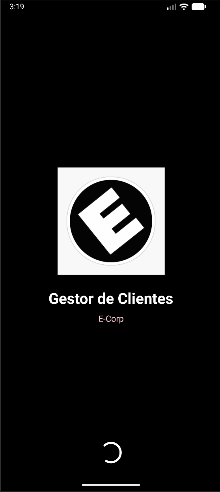
*Pantalla de bienvenida con logo animado y nombre de la aplicación*

#### 2. Pantalla Principal - Modo Diestro
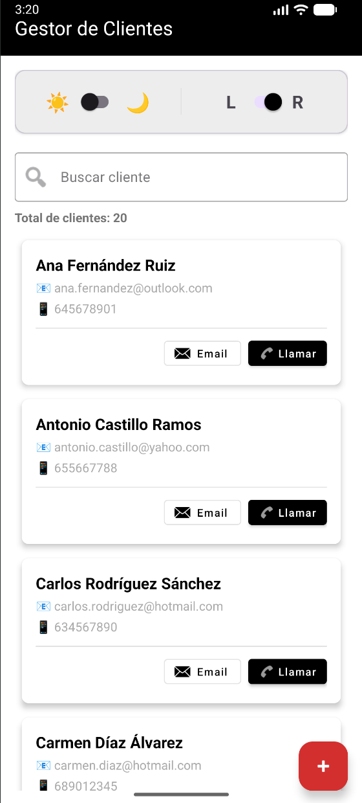
*Lista de clientes con panel de control, búsqueda, contador y botón flotante a la derecha*

#### 3. Pantalla Principal - Modo Zurdo
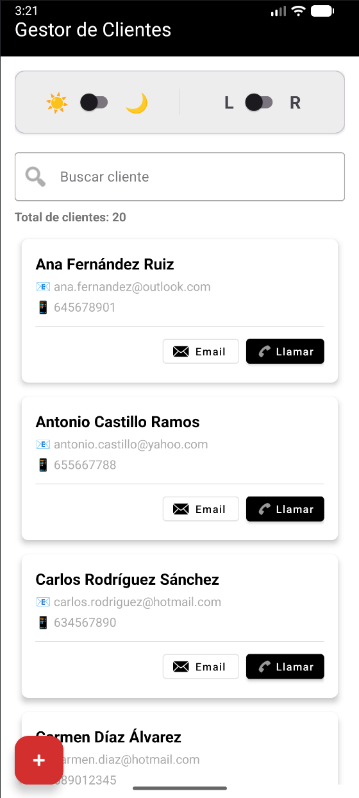
*Misma vista con el botón flotante posicionado a la izquierda para usuarios zurdos*

#### 4. Panel de Control
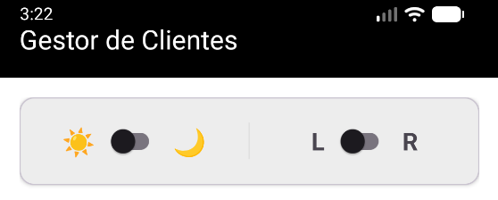
*Panel con switches para cambiar tema (☀️/🌙) y modo de mano (L/R)*

#### 5. Búsqueda en Tiempo Real
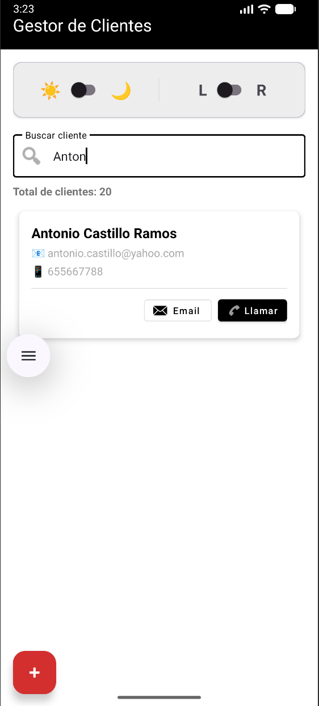
*Filtrado instantáneo de clientes mientras se escribe*

#### 6. Formulario Nuevo Cliente
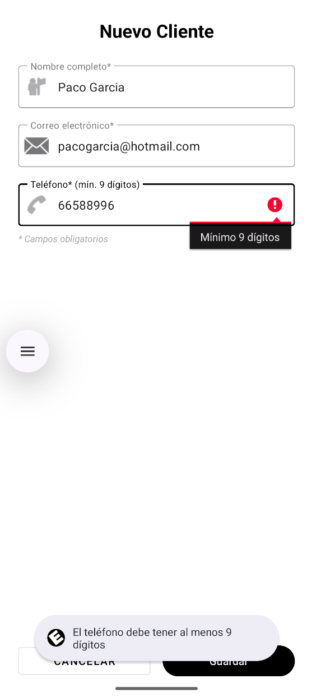
*Formulario para añadir un nuevo cliente con validaciones*

#### 7. Formulario Editar Cliente
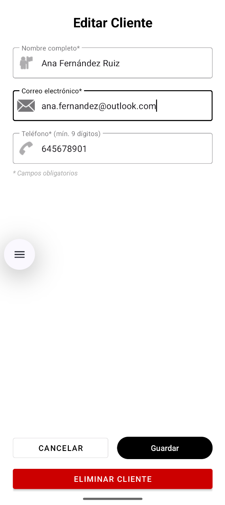
*Formulario con datos prellenados y botón de eliminar visible*

#### 8. Validaciones
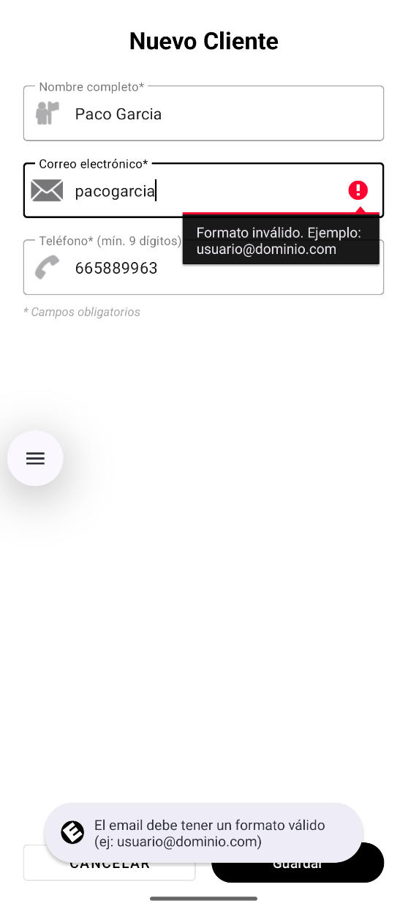
*Mensajes de error cuando los campos no cumplen las validaciones*

#### 9. Diálogo de Confirmación
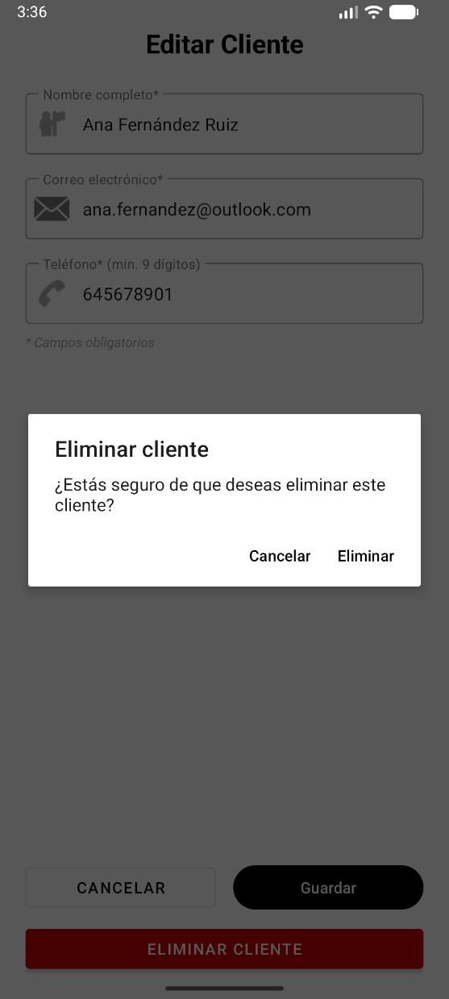
*Confirmación antes de eliminar un cliente*

#### 10. Botones de Acción
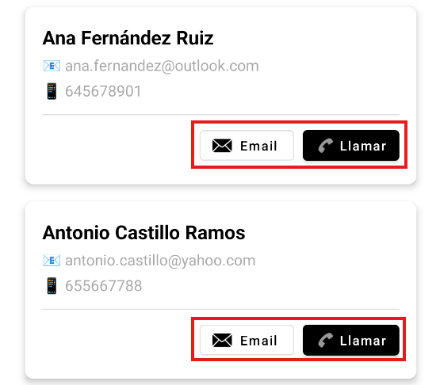
*Botones de email y llamar en cada tarjeta de cliente*

---

### Modo Oscuro

#### 11. Pantalla Principal Oscura - Modo Diestro
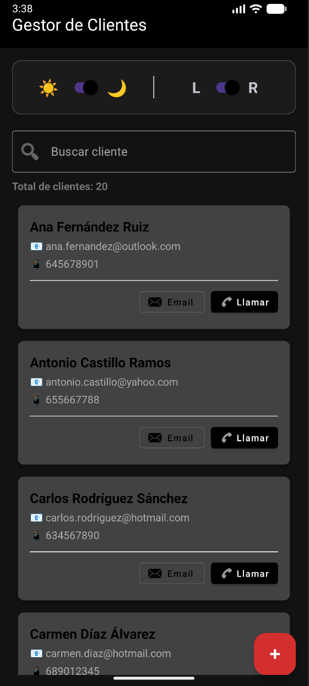
*Vista principal en modo oscuro con botón a la derecha*

#### 12. Pantalla Principal Oscura - Modo Zurdo
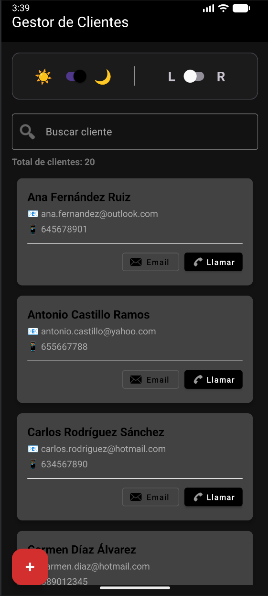
*Vista principal en modo oscuro con botón a la izquierda*

#### 13. Panel de Control Oscuro
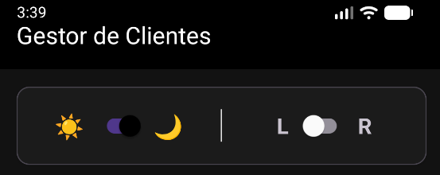
*Panel de control adaptado al modo oscuro*

#### 14. Formulario Oscuro
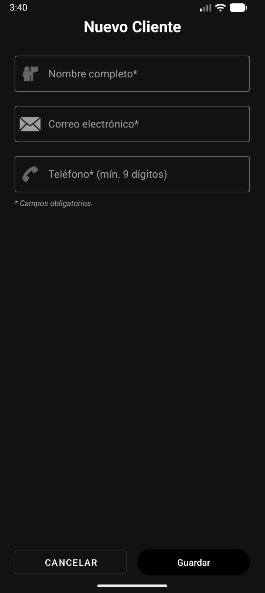
*Formulario con colores optimizados para modo oscuro (texto blanco, bordes visibles)*

---

## 📊 Modelo de Datos

### Estructura de la Base de Datos

#### Base de Datos: `clientes.db`
- **Tipo:** SQLite
- **Versión:** 1
- **Ubicación:** `/data/data/com.dam.aplicacioncrm/databases/clientes.db`

#### Tabla: `clientes`

| Columna   | Tipo    | Descripción                              | Restricciones              |
|-----------|---------|------------------------------------------|----------------------------|
| `id`      | INTEGER | Identificador único del cliente          | PRIMARY KEY, AUTOINCREMENT |
| `nombre`  | TEXT    | Nombre completo del cliente              | NOT NULL                   |
| `email`   | TEXT    | Correo electrónico del cliente           | NOT NULL                   |
| `telefono`| TEXT    | Número de teléfono del cliente           | NOT NULL                   |

#### SQL de Creación
```sql
CREATE TABLE clientes (
    id INTEGER PRIMARY KEY AUTOINCREMENT,
    nombre TEXT NOT NULL,
    email TEXT NOT NULL,
    telefono TEXT NOT NULL
);
```

### Clase del Modelo (Kotlin)

```kotlin
data class Cliente(
    val id: Int = 0,
    val nombre: String,
    val email: String,
    val telefono: String
) {
    // Métodos de validación
    fun esValido(): Boolean
    fun emailEsValido(): Boolean
    fun telefonoEsValido(): Boolean
}
```

### Operaciones de Base de Datos

La clase `DatabaseHelper` implementa todas las operaciones CRUD:

| Método | Descripción | Parámetros | Retorno |
|--------|-------------|------------|---------|
| `insertarCliente()` | Inserta un nuevo cliente | Cliente | Long (ID insertado) |
| `obtenerTodosLosClientes()` | Obtiene todos los clientes | - | List\<Cliente\> |
| `actualizarCliente()` | Actualiza un cliente existente | Cliente | Int (filas afectadas) |
| `eliminarCliente()` | Elimina un cliente por ID | Int | Int (filas eliminadas) |
| `buscarClientes()` | Busca clientes por nombre o email | String | List\<Cliente\> |
| `contarClientes()` | Cuenta el total de clientes | - | Int |

### Ejemplo de Uso

```kotlin
// Crear instancia del helper
val dbHelper = DatabaseHelper(context)

// Insertar un cliente
val nuevoCliente = Cliente(
    nombre = "Juan Pérez",
    email = "juan@example.com",
    telefono = "612345678"
)
val id = dbHelper.insertarCliente(nuevoCliente)

// Obtener todos los clientes
val clientes = dbHelper.obtenerTodosLosClientes()

// Buscar clientes
val resultados = dbHelper.buscarClientes("Juan")

// Actualizar un cliente
val clienteActualizado = nuevoCliente.copy(telefono = "623456789")
dbHelper.actualizarCliente(clienteActualizado)

// Eliminar un cliente
dbHelper.eliminarCliente(id.toInt())

// Contar clientes
val total = dbHelper.contarClientes()
```

---

## 🏗️ Arquitectura del Proyecto

### Estructura de Paquetes

```
com.dam.aplicacioncrm/
├── activities/
│   ├── SplashActivity.kt           # Pantalla de bienvenida
│   ├── MainActivity.kt              # Pantalla principal con lista
│   └── FormularioClienteActivity.kt # Formulario crear/editar
├── adapters/
│   └── ClienteAdapter.kt            # Adapter del RecyclerView
├── database/
│   └── DatabaseHelper.kt            # Gestor de SQLite
├── models/
│   └── Cliente.kt                   # Modelo de datos
└── utils/
    └── ThemePreference.kt           # Gestor de preferencias de tema
```

### Layouts XML

```
res/layout/
├── activity_splash.xml              # Layout del splash screen
├── activity_main.xml                # Layout pantalla principal
├── activity_formulario_cliente.xml  # Layout formulario
└── item_cliente.xml                 # Item del RecyclerView
```

### Recursos

```
res/
├── values/
│   ├── colors.xml                   # Colores (modo claro)
│   ├── themes.xml                   # Tema (modo claro)
│   └── strings.xml                  # Textos de la aplicación
├── values-night/
│   ├── colors.xml                   # Colores (modo oscuro)
│   └── themes.xml                   # Tema (modo oscuro)
├── drawable/
│   └── splash_logo.png              # Logo de la aplicación
└── menu/
    └── main_menu.xml                # (Opcional) Menú de opciones
```

---

## 🛠️ Tecnologías Utilizadas

### Lenguajes y Frameworks
- **Kotlin** - Lenguaje de programación principal
- **XML** - Diseño de interfaces de usuario

### Componentes de Android
- **Activities** - Gestión de pantallas
- **RecyclerView** - Lista eficiente de clientes
- **SQLite** - Base de datos local
- **SharedPreferences** - Almacenamiento de preferencias

### Librerías de Material Design
- **Material Components** - Componentes UI modernos
- **TextInputLayout** - Campos de texto mejorados
- **FloatingActionButton** - Botón de acción principal
- **MaterialCardView** - Tarjetas de clientes
- **AlertDialog** - Diálogos de confirmación

### APIs de Android Utilizadas
- **Patterns.EMAIL_ADDRESS** - Validación de emails con patrón oficial RFC 5322
- **SQLiteOpenHelper** - Gestión de base de datos local
- **SharedPreferences** - Almacenamiento de preferencias de usuario
- **Intent** - Navegación entre Activities e integración con apps nativas

### Características de Kotlin
- **Data Classes** - Modelo de datos limpio y conciso
- **Extension Functions** - Código más expresivo y reutilizable
- **Lambdas** - Callbacks y listeners simplificados
- **Null Safety** - Prevención de errores NullPointerException
- **String Methods** - `isNotBlank()`, `trim()`, `lowercase()` para validación y normalización

---

## 📝 Validaciones Implementadas

### Campo Nombre
- ✅ Validación con `isNotBlank()` (método oficial de Kotlin)
- ✅ No puede estar vacío ni contener solo espacios
- ✅ Mensaje de error: "El nombre es obligatorio"
- ✅ Toast: "Por favor, introduce un nombre válido"

### Campo Email
- ✅ Validación con `Patterns.EMAIL_ADDRESS.matcher(email).matches()` (patrón oficial de Android)
- ✅ No puede estar vacío
- ✅ Debe tener formato válido según estándares RFC 5322
- ✅ Mensaje de error en campo: "Formato inválido. Ejemplo: usuario@dominio.com"
- ✅ Toast: "El email debe tener un formato válido (ej: usuario@dominio.com)"
- ✅ **Normalización automática:** 
  - Se convierte a minúsculas: `Juan@Email.COM` → `juan@email.com`
  - Se eliminan espacios: `email@domain.com `

### Campo Teléfono
- ✅ Validación: `telefono.trim().length >= 9` con solo dígitos
- ✅ No puede estar vacío
- ✅ Debe contener al menos 9 dígitos numéricos
- ✅ Se extraen solo dígitos para validar (ignora espacios, guiones, paréntesis)
- ✅ Mensaje de error en campo: "Debe tener al menos 9 dígitos"
- ✅ Toast: "El teléfono debe contener al menos 9 dígitos"
- ✅ **Normalización automática:**
  - Se eliminan espacios: `612 345 678` → `612345678`
  - Se eliminan guiones: `612-345-678` → `612345678`

### Características de las Validaciones
- **setError()** - Muestra indicador visual en el campo con error
- **requestFocus()** - Posiciona el cursor automáticamente en el campo erróneo
- **Bloqueo de guardado** - Si falla alguna validación, NO se persiste el cliente
- **Limpieza de errores** - Los errores previos se limpian antes de cada nueva validación
- **Validaciones separadas** - Cada campo tiene su propia función de validación
- **Mensajes descriptivos** - Feedback claro y útil para el usuario
---

## 🎨 Diseño y UX

### Principios Aplicados
- **Material Design 3** - Diseño moderno y coherente
- **Tema negro** - Cabecera elegante y profesional
- **Botones rojos** - Llamativos y fáciles de identificar
- **Feedback visual** - Toast messages y diálogos
- **Confirmaciones** - AlertDialog antes de acciones destructivas
- **Búsqueda intuitiva** - Resultados en tiempo real
- **Navegación clara** - FloatingActionButton y clicks intuitivos

### Accesibilidad
- **Modo oscuro** - Reduce fatiga visual
- **Modo zurdo** - Mejora ergonomía para usuarios zurdos
- **Iconos descriptivos** - Facilitan comprensión
- **Mensajes claros** - Feedback comprensible
- **Colores contrastantes** - Buena legibilidad

---

## 🐛 Solución de Problemas

### La app no compila
1. Ve a **Build → Clean Project**
2. Luego **Build → Rebuild Project**
3. Espera a que Gradle sincronice completamente

### No aparecen los clientes de ejemplo
1. **Desinstala la app** del emulador/dispositivo
2. Vuelve a ejecutar desde Android Studio
3. Los datos se crearán en la primera instalación

### Los switches no guardan preferencias
1. Verifica que existe `ThemePreference.kt` en el paquete `utils`
2. Asegúrate de que `SharedPreferences` tiene permisos
3. Prueba limpiando los datos de la app

### El modo oscuro no se aplica correctamente
1. Verifica que existe `res/values-night/themes.xml`
2. Verifica que existe `res/values-night/colors.xml`
3. Limpia el proyecto y reconstruye

### El botón + no se mueve
1. Verifica que `ThemePreference.saveHandMode()` se llama correctamente
2. Comprueba que el layout principal usa `CoordinatorLayout`
3. Reinicia la app después de cambiar el switch

---

## 📚 Objetivos de Aprendizaje Alcanzados

✅ Implementar un CRUD completo en Android con SQLite  
✅ Usar RecyclerView con Adapter personalizado  
✅ Validar y manejar datos introducidos por el usuario  
✅ Dominar eventos (click, long click, alertas)  
✅ Comprender el ciclo de vida de Activities  
✅ Implementar persistencia de datos local  
✅ Aplicar Material Design a una aplicación  
✅ Gestionar temas claro/oscuro dinámicamente  
✅ Implementar características de accesibilidad  
✅ Integrar con aplicaciones nativas del sistema  
✅ Documentar y presentar un proyecto profesional  

---

## 👨‍💻 Información del Proyecto

**Alumno:** Esteban Garcés Pérez  
**Curso:** 2º Desarrollo de Aplicaciones Multiplataforma (DAM)  
**Asignatura:** Programación Multimedia y Dispositivos Móviles (PMDM)  
**Profesor:** Iván Carrasco
**Fecha de Entrega:** 24/10/2025

---

## 📄 Licencia

Este proyecto es parte de una actividad educativa para el ciclo de Desarrollo de Aplicaciones Multiplataforma (DAM). Desarrollado con fines académicos.

---

## 🔗 Enlaces Útiles

- [Documentación oficial de Android](https://developer.android.com)
- [Kotlin Documentation](https://kotlinlang.org/docs/home.html)
- [Material Design Components](https://material.io/components)
- [SQLite en Android](https://developer.android.com/training/data-storage/sqlite)
- [RecyclerView Guide](https://developer.android.com/guide/topics/ui/layout/recyclerview)

---

## ✨ Características Destacadas

Este proyecto va más allá de los requisitos mínimos, implementando:

- 🎨 **Diseño profesional** con tema personalizado negro y rojo
- 🌙 **Modo oscuro completo** optimizado con colores adaptados
- ♿ **Accesibilidad mejorada** con modo zurdo/diestro
- 📞 **Integración con apps nativas** (teléfono y email)
- 🎬 **Animaciones fluidas** en toda la aplicación
- 💾 **20 clientes precargados** para demostración inmediata
- 🔍 **Búsqueda en tiempo real** eficiente con filtrado instantáneo
- ✅ **Validaciones robustas** usando APIs oficiales de Android:
  - `Patterns.EMAIL_ADDRESS` para validación de emails (RFC 5322)
  - `isNotBlank()` para validación de campos obligatorios
  - Extracción de dígitos para validación de teléfonos
- 🔄 **Normalización automática de datos**:
  - Emails a minúsculas y sin espacios
  - Teléfonos sin espacios ni guiones
- 🎯 **Código limpio y documentado** siguiendo mejores prácticas y estándares de la industria
- 📱 **Feedback visual claro** con `setError()` y mensajes descriptivos
- 🚫 **Bloqueo inteligente** que previene guardar datos inválidos

---

**¡Gracias por revisar este proyecto!** 🚀